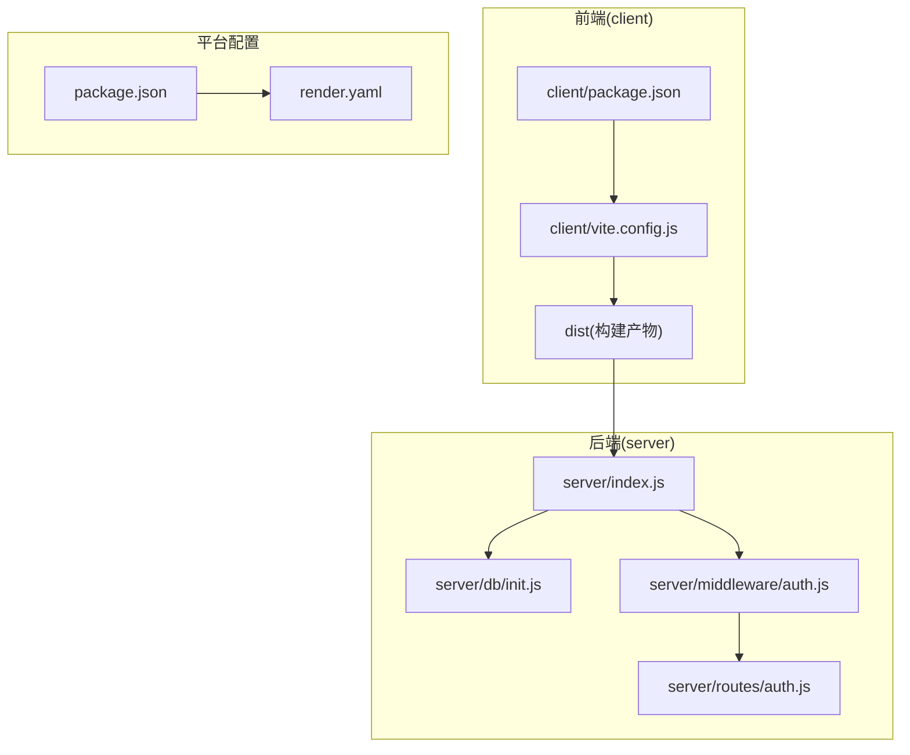
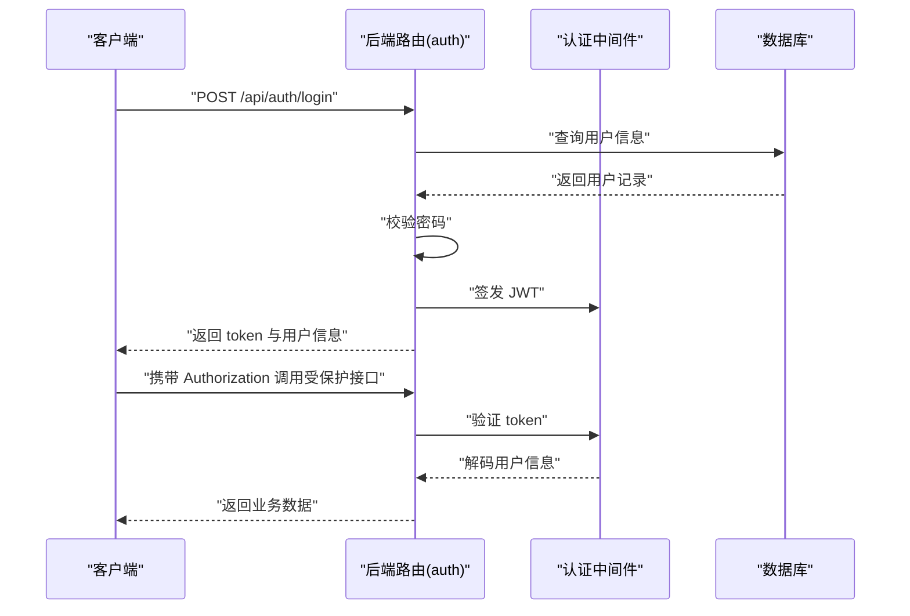

# 部署指南

<cite>
**本文引用的文件**
- [render.yaml](file://render.yaml)
- [package.json](file://package.json)
- [client/package.json](file://client/package.json)
- [server/package.json](file://server/package.json)
- [client/vite.config.js](file://client/vite.config.js)
- [server/index.js](file://server/index.js)
- [server/db/init.js](file://server/db/init.js)
- [server/middleware/auth.js](file://server/middleware/auth.js)
- [server/routes/auth.js](file://server/routes/auth.js)
- [client/src/api/index.js](file://client/src/api/index.js)
- [.gitignore](file://.gitignore)
</cite>

## 更新摘要
**所做更改**
- 更新了 Vite 构建系统的版本管理和构建命令配置，采用固定版本号和直接 bin 调用方式
- 优化了 Render 平台部署配置，增强了构建稳定性和兼容性
- 更新了开发环境部署说明，反映了新的构建流程改进
- 增强了故障排除指南，增加了与新构建系统相关的排查要点

## 目录
1. [简介](#简介)
2. [项目结构](#项目结构)
3. [核心组件](#核心组件)
4. [架构总览](#架构总览)
5. [详细组件分析](#详细组件分析)
6. [依赖分析](#依赖分析)
7. [性能考虑](#性能考虑)
8. [故障排除指南](#故障排除指南)
9. [结论](#结论)
10. [附录](#附录)

## 简介
本指南面向 SY-Q 系统的部署与运维，覆盖开发与生产环境的部署步骤、环境变量配置、依赖安装、Render 平台部署配置、Docker 容器化方案、Nginx 反向代理与静态资源优化策略，并提供监控、日志收集与故障排除的运维建议。文档中的实现细节均基于仓库现有文件进行总结与提炼。

**更新** 本版本反映了构建系统的重大改进：采用固定版本的 Vite（5.4.19）和直接 bin 调用方式，显著提升了构建稳定性和兼容性，同时 Render 平台部署配置也进行了相应的优化升级。

## 项目结构
SY-Q 采用前后端分离架构：
- 前端位于 client 目录，使用 Vite + React 技术栈，构建产物输出到根目录 dist。
- 后端位于 server 目录，基于 Express 提供 REST API，并通过 better-sqlite3 访问本地 SQLite 数据库。
- 根目录包含统一的 Node 脚本与渲染平台配置文件。

**图表来源**
- [client/vite.config.js:1-20](file://client/vite.config.js#L1-L20)
- [server/index.js:1-120](file://server/index.js#L1-L120)
- [server/db/init.js:1-217](file://server/db/init.js#L1-L217)
- [server/middleware/auth.js:1-29](file://server/middleware/auth.js#L1-L29)
- [server/routes/auth.js:1-69](file://server/routes/auth.js#L1-L69)
- [render.yaml:1-13](file://render.yaml#L1-L13)
- [package.json:1-13](file://package.json#L1-L13)

**章节来源**
- [client/vite.config.js:1-20](file://client/vite.config.js#L1-L20)
- [server/index.js:1-120](file://server/index.js#L1-L120)
- [server/db/init.js:1-217](file://server/db/init.js#L1-L217)
- [render.yaml:1-13](file://render.yaml#L1-L13)
- [package.json:1-13](file://package.json#L1-L13)

## 核心组件
- 前端构建与代理
  - 开发时前端通过 Vite 代理将 /api 前缀请求转发至后端服务，默认目标为本地 3001 端口。
  - 构建产物输出到根目录 dist，用于生产环境静态托管。
- 后端服务
  - 使用 Express 提供 REST 接口，启用安全头、CORS、请求体大小限制与全局速率限制。
  - 静态资源托管：生产环境将 dist 作为静态目录，所有未匹配路径回退到 index.html，支持 SPA 路由。
  - 数据库初始化：首次运行时自动创建表结构、迁移字段并插入默认数据。
- 认证中间件
  - 基于 JWT 的认证与授权，要求请求头携带 Bearer Token；管理员接口需具备 admin 角色。
- 渲染平台配置
  - Render 平台使用 Node 运行时，统一构建命令同时安装 client 与 server 依赖并执行前端构建，随后启动后端服务。
  - **新增优化**：构建命令包含清理步骤和直接 bin 调用方式，显著提升构建稳定性。

**更新** 构建系统已进行全面优化，采用固定版本的 Vite（5.4.19）和直接 bin 调用方式，确保构建过程的一致性和可预测性。

**章节来源**
- [client/vite.config.js:1-20](file://client/vite.config.js#L1-L20)
- [server/index.js:1-120](file://server/index.js#L1-L120)
- [server/db/init.js:1-217](file://server/db/init.js#L1-L217)
- [server/middleware/auth.js:1-29](file://server/middleware/auth.js#L1-L29)
- [render.yaml:1-13](file://render.yaml#L1-L13)

## 架构总览
下图展示从客户端到后端 API 再到数据库的整体交互关系，以及静态资源回退机制。

```mermaid
graph TB
Browser["浏览器(SPA)"] --> FE_PROXY["Vite 开发代理(/api -> 3001)"]
Browser --> Static["静态资源(dist)"]
subgraph "后端服务"
EX["Express 应用"]
SEC["安全中间件<br/>Helmet/CORS/限流"]
AUTH["认证中间件(JWT)"]
ROUTES["路由模块"]
DB["SQLite 数据库(better-sqlite3)"]
end
Browser --> EX
EX --> SEC
SEC --> AUTH
AUTH --> ROUTES
ROUTES --> DB
EX --> Static
```

**图表来源**
- [server/index.js:1-120](file://server/index.js#L1-L120)
- [server/db/init.js:1-217](file://server/db/init.js#L1-L217)
- [client/vite.config.js:1-20](file://client/vite.config.js#L1-L20)

## 详细组件分析

### 开发环境部署
- 前端开发
  - 在 client 目录执行开发服务器启动脚本，监听本地端口并启用代理，将 /api 请求转发至后端。
  - 代理配置默认目标为本地 3001 端口，确保与后端服务一致。
- 后端开发
  - 在 server 目录启动后端服务，监听默认端口或通过环境变量指定端口。
  - CORS 配置允许本地开发域名与 Render 子域名访问，便于联调。
- 构建产物
  - 前端构建生成 dist 目录，用于生产环境静态托管。

**更新** 构建系统已优化，采用固定版本的 Vite（5.4.19）确保开发环境与生产环境的一致性，同时使用直接 bin 调用方式提升构建性能。

**章节来源**
- [client/vite.config.js:1-20](file://client/vite.config.js#L1-L20)
- [server/index.js:1-120](file://server/index.js#L1-L120)

### 生产环境部署
- 依赖安装
  - 根目录统一安装 Node.js 运行时与依赖，确保前后端构建与运行所需工具齐全。
- 静态资源托管
  - 后端在生产环境启用静态目录托管，将 dist 作为静态资源根目录。
  - 所有未匹配的路径回退到 index.html，以支持前端路由。
- 数据库初始化
  - 首次启动时自动创建表结构、外键约束与必要字段，并插入默认管理员账户与系统名称。

**章节来源**
- [server/index.js:1-120](file://server/index.js#L1-L120)
- [server/db/init.js:1-217](file://server/db/init.js#L1-L217)

### Render 平台部署配置
- 运行时与构建
  - 使用 Node 运行时，构建命令按顺序安装 client 与 server 依赖并执行前端构建，再启动后端服务。
  - **新增优化**：构建命令包含清理步骤 `rm -rf node_modules .vite-temp` 和 `rm -rf node_modules`，有效清理构建缓存和临时文件，提高构建稳定性。
  - **改进的构建方式**：使用 `./node_modules/.bin/vite build` 直接调用 Vite 二进制文件，替代传统的 `npx vite build` 方式，确保构建过程更加稳定和可预测。
- 启动命令
  - 通过统一脚本启动后端入口文件。
- 环境变量
  - 设置 NODE_ENV=production 与 PORT=10000，确保生产模式与端口正确。
- 计划与域名
  - 当前计划为免费版，平台会分配子域名，CORS 已内置对 .onrender.com 子域名的放行。

**更新** Render 部署配置已显著改进，新增了清理步骤以解决构建缓存问题，采用直接 bin 调用方式确保 Vite 构建的稳定性。

**章节来源**
- [render.yaml:1-13](file://render.yaml#L1-L13)
- [package.json:1-13](file://package.json#L1-L13)

### Docker 容器化部署方案
- 基础镜像与 Node 版本
  - 使用官方 Node LTS 镜像，版本要求满足项目引擎声明。
- 多阶段构建建议
  - 第一阶段：安装 client 与 server 依赖并执行前端构建，产物输出到 dist。
  - 第二阶段：仅复制 dist 与 server 产物，安装运行时依赖，启动后端服务。
- 环境变量
  - 设置 NODE_ENV=production 与 PORT，确保生产模式与端口正确。
- 数据持久化
  - 将数据库文件映射到宿主机卷，避免容器重建导致数据丢失。
- 健康检查
  - 添加健康检查端点，定期探测后端可用性。

（本节为通用容器化实践建议，未直接引用具体文件）

### Nginx 反向代理与静态资源优化
- 反向代理
  - 将 /api 前缀代理至后端服务地址，实现跨域与统一入口。
- 静态资源优化
  - 开启 gzip/br 压缩与缓存头，合理设置缓存时间。
  - 对 dist 目录启用强缓存策略，结合文件指纹命名提升缓存命中率。
- 回退策略
  - 对于未匹配的路径，将请求回退到 index.html，保障前端路由正常工作。

（本节为通用 Nginx 最佳实践，未直接引用具体文件）

### API 流程示例：登录鉴权
以下序列图展示前端登录请求经由后端认证中间件与路由处理的完整流程。

**图表来源**
- [server/routes/auth.js:1-69](file://server/routes/auth.js#L1-L69)
- [server/middleware/auth.js:1-29](file://server/middleware/auth.js#L1-L29)
- [server/db/init.js:1-217](file://server/db/init.js#L1-L217)

## 依赖分析
- 前端依赖
  - React、Ant Design、Axios、React Router、Recharts 等，支撑用户界面与数据可视化。
- 后端依赖
  - Express、Helmet、CORS、bcryptjs、better-sqlite3、jsonwebtoken、rate-limit 等，提供安全、认证、数据库访问与限流能力。
- 构建与脚本
  - Vite 5.4.19 用于开发与构建，采用固定版本确保构建稳定性，根目录脚本统一执行前后端安装与构建。

**更新** Vite 版本已固定为 5.4.19，采用直接 bin 调用方式确保构建过程的一致性和可预测性。

**章节来源**
- [client/package.json:1-26](file://client/package.json#L1-L26)
- [server/package.json:1-26](file://server/package.json#L1-L26)
- [package.json:1-13](file://package.json#L1-L13)

## 性能考虑
- 限流与安全
  - 全局与登录接口分别设置速率限制，降低暴力破解与滥用风险。
  - 启用安全响应头与严格的 CORS 策略，减少攻击面。
- 数据库优化
  - 启用 WAL 模式与外键约束，提升并发读写与数据一致性。
- 前端性能
  - 构建产物输出到 dist，配合 CDN 与缓存策略可显著提升加载速度。
- 运行时参数
  - 在生产环境中设置合适的 NODE_ENV 与端口，避免不必要的调试开销。

**更新** 新的构建系统通过固定版本控制和直接 bin 调用方式显著提升了构建性能和稳定性。

**章节来源**
- [server/index.js:1-120](file://server/index.js#L1-L120)
- [server/db/init.js:1-217](file://server/db/init.js#L1-L217)

## 故障排除指南
- CORS 错误
  - 若出现"不允许的来源"，检查 ALLOWED_ORIGINS 环境变量与平台域名是否在允许列表中。
- 401 未登录/过期
  - 检查前端是否正确存储与携带 Bearer Token；确认后端 JWT 密钥一致。
- 静态资源 404
  - 确认 dist 目录存在且后端已启用静态托管；检查回退逻辑是否生效。
- 数据库异常
  - 确认数据库文件权限与路径正确；如需迁移，检查初始化脚本中的迁移逻辑。
- 环境变量与忽略文件
  - .env 与数据库文件被 .gitignore 忽略，部署时请通过平台环境变量注入敏感配置。
- **新增** 构建缓存问题
  - 如果遇到构建失败或缓存相关错误，检查是否正确执行了清理步骤；确认 Vite 版本是否为固定版本 5.4.19。
- **新增** Vite 版本不兼容
  - 如果构建过程中出现版本相关错误，确保使用固定版本 5.4.19，避免使用 `npx` 或直接调用方式导致的版本冲突。

**更新** 新增了与构建缓存和 Vite 版本控制相关的故障排除指导。

**章节来源**
- [server/index.js:1-120](file://server/index.js#L1-L120)
- [client/src/api/index.js:1-42](file://client/src/api/index.js#L1-L42)
- [.gitignore:1-33](file://.gitignore#L1-L33)

## 结论
SY-Q 系统具备清晰的前后端分离架构与完善的生产部署基础。通过 Render 平台可快速上线，同时支持 Docker 容器化与 Nginx 反向代理扩展。**最新的构建系统改进**显著提升了部署可靠性，包括固定版本的 Vite（5.4.19）、直接 bin 调用方式和清理步骤集成。建议在生产环境中完善环境变量管理、数据库备份与监控告警体系，持续优化静态资源与 API 性能，确保系统稳定可靠。

## 附录
- 环境变量清单
  - NODE_ENV：运行模式（development/production）
  - PORT：服务监听端口
  - ALLOWED_ORIGINS：额外允许的来源域名，多个以逗号分隔
- 关键文件路径
  - 前端构建与代理：client/vite.config.js
  - 后端入口与静态托管：server/index.js
  - 数据库初始化：server/db/init.js
  - 认证中间件：server/middleware/auth.js
  - 登录路由：server/routes/auth.js
  - 前端 API 客户端：client/src/api/index.js
  - 平台配置：render.yaml
  - 统一脚本：package.json

**章节来源**
- [server/index.js:1-120](file://server/index.js#L1-L120)
- [server/db/init.js:1-217](file://server/db/init.js#L1-L217)
- [server/middleware/auth.js:1-29](file://server/middleware/auth.js#L1-L29)
- [server/routes/auth.js:1-69](file://server/routes/auth.js#L1-L69)
- [client/src/api/index.js:1-42](file://client/src/api/index.js#L1-L42)
- [render.yaml:1-13](file://render.yaml#L1-L13)
- [package.json:1-13](file://package.json#L1-L13)