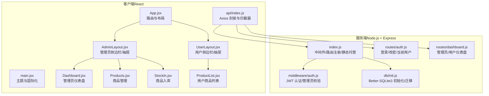
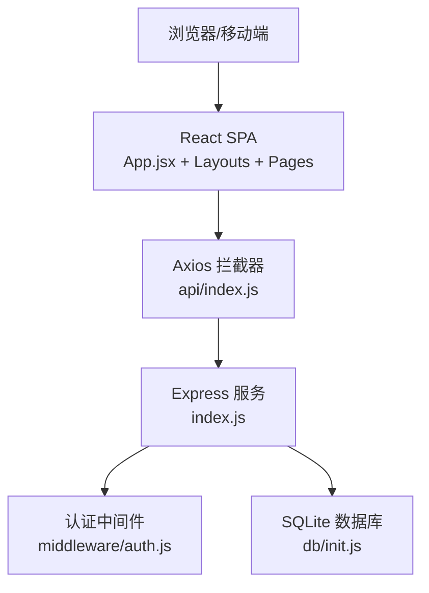
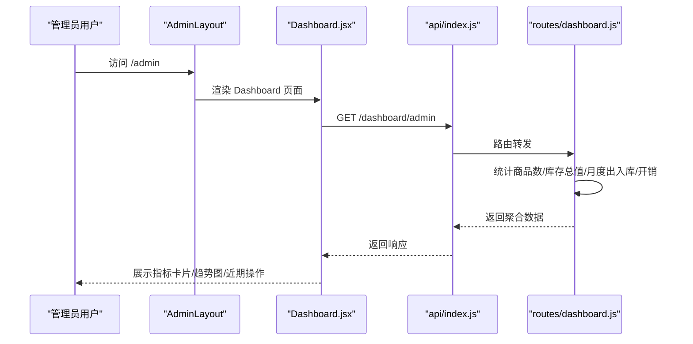
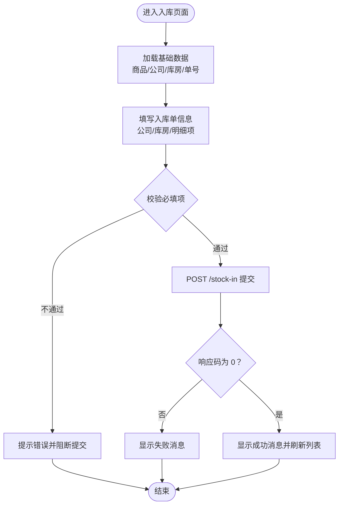
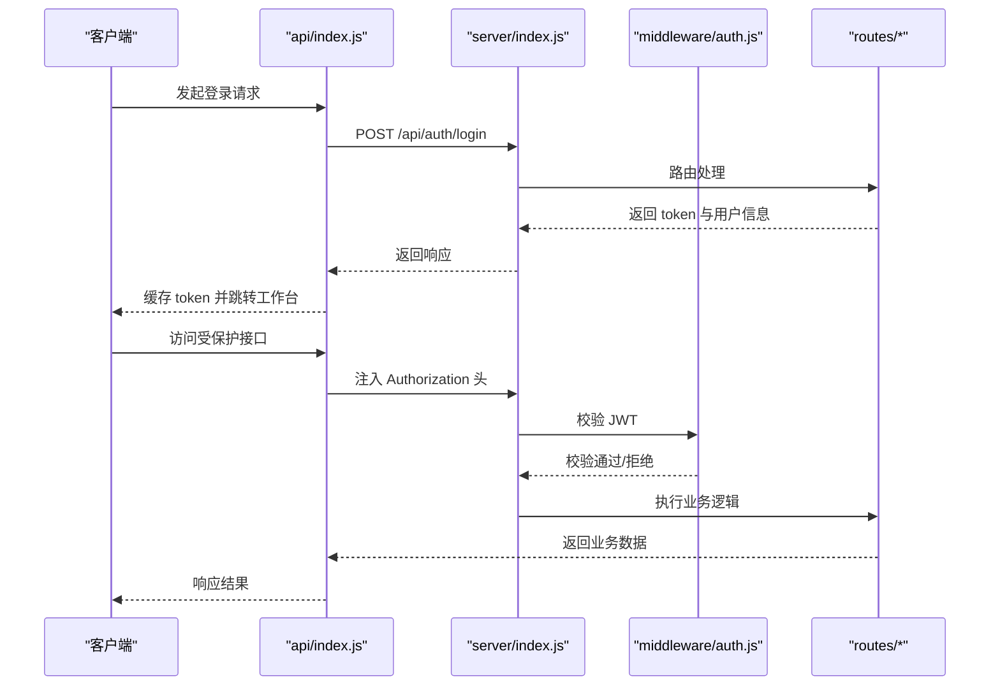

# 项目概述

<cite>
**本文引用的文件**
- [client/package.json](file://client/package.json)
- [server/package.json](file://server/package.json)
- [client/src/App.jsx](file://client/src/App.jsx)
- [client/src/main.jsx](file://client/src/main.jsx)
- [client/src/layouts/AdminLayout.jsx](file://client/src/layouts/AdminLayout.jsx)
- [client/src/layouts/UserLayout.jsx](file://client/src/layouts/UserLayout.jsx)
- [client/src/pages/admin/Dashboard.jsx](file://client/src/pages/admin/Dashboard.jsx)
- [client/src/pages/admin/Products.jsx](file://client/src/pages/admin/Products.jsx)
- [client/src/pages/admin/StockIn.jsx](file://client/src/pages/admin/StockIn.jsx)
- [client/src/pages/user/ProductList.jsx](file://client/src/pages/user/ProductList.jsx)
- [client/src/api/index.js](file://client/src/api/index.js)
- [server/index.js](file://server/index.js)
- [server/middleware/auth.js](file://server/middleware/auth.js)
- [server/db/init.js](file://server/db/init.js)
- [server/routes/auth.js](file://server/routes/auth.js)
- [server/routes/dashboard.js](file://server/routes/dashboard.js)
- [render.yaml](file://render.yaml)
</cite>

## 目录
1. [引言](#引言)
2. [项目结构](#项目结构)
3. [核心组件](#核心组件)
4. [架构总览](#架构总览)
5. [详细组件分析](#详细组件分析)
6. [依赖关系分析](#依赖关系分析)
7. [性能考虑](#性能考虑)
8. [故障排查指南](#故障排查指南)
9. [结论](#结论)
10. [附录](#附录)

## 引言
SY-Q 做账管理系统是一套面向中小型企业的财务管理与库存跟踪一体化平台。系统围绕“财务+库存”双主线设计，提供从商品管理、出入库操作到日常开销统计的完整闭环；同时内置多角色权限体系（管理员/普通用户），支持系统参数配置、数据中心与报表统计，帮助用户实现高效、透明、可追溯的日常运营与财务记账。

系统的核心价值在于：
- 统一入口：前后端分离架构，前端采用现代化 React 技术栈，后端基于 Node.js + Express 提供 RESTful 接口，便于扩展与维护。
- 安全可靠：内置 JWT 登录认证、CORS 白名单、速率限制与安全头部，保障访问安全与稳定性。
- 易用高效：以仪表盘为中心的工作台，提供快捷入口、趋势图表与近期操作汇总，降低上手成本。
- 数据驱动：以 Better-SQLite3 作为本地化数据库，兼顾易部署与性能，满足中小规模业务的数据存储需求。

## 项目结构
项目采用典型的前后端分离架构，客户端（React）与服务端（Node.js）分别独立开发与构建，通过统一的 /api 前缀进行通信。部署时由渲染平台统一打包与启动。



图示来源
- [client/src/App.jsx:1-67](file://client/src/App.jsx#L1-L67)
- [client/src/main.jsx:1-14](file://client/src/main.jsx#L1-L14)
- [client/src/layouts/AdminLayout.jsx:1-174](file://client/src/layouts/AdminLayout.jsx#L1-L174)
- [client/src/layouts/UserLayout.jsx:1-162](file://client/src/layouts/UserLayout.jsx#L1-L162)
- [client/src/pages/admin/Dashboard.jsx:1-123](file://client/src/pages/admin/Dashboard.jsx#L1-L123)
- [client/src/pages/admin/Products.jsx:1-134](file://client/src/pages/admin/Products.jsx#L1-L134)
- [client/src/pages/admin/StockIn.jsx:1-369](file://client/src/pages/admin/StockIn.jsx#L1-L369)
- [client/src/pages/user/ProductList.jsx:1-221](file://client/src/pages/user/ProductList.jsx#L1-L221)
- [client/src/api/index.js:1-42](file://client/src/api/index.js#L1-L42)
- [server/index.js:1-120](file://server/index.js#L1-L120)
- [server/middleware/auth.js:1-29](file://server/middleware/auth.js#L1-L29)
- [server/db/init.js:1-217](file://server/db/init.js#L1-L217)
- [server/routes/auth.js:1-69](file://server/routes/auth.js#L1-L69)
- [server/routes/dashboard.js:1-92](file://server/routes/dashboard.js#L1-L92)

章节来源
- [client/src/App.jsx:1-67](file://client/src/App.jsx#L1-L67)
- [client/src/main.jsx:1-14](file://client/src/main.jsx#L1-L14)
- [server/index.js:1-120](file://server/index.js#L1-L120)

## 核心组件
- 客户端路由与布局
  - App.jsx：集中定义登录页与管理员/用户两条路由路径，配合私有路由守卫确保登录态校验。
  - AdminLayout/UserLayout：分别承载管理员与普通用户的导航菜单、移动端抽屉、系统标题加载与登出流程。
- API 封装与拦截器
  - api/index.js：统一 baseURL、请求头注入（Authorization）、响应拦截（401 自动跳转登录）与错误提示。
- 服务端中间件与数据库
  - middleware/auth.js：JWT 校验与管理员权限校验，保证受保护接口的安全访问。
  - db/init.js：初始化 SQLite 数据库、建表与字段迁移、默认管理员与系统名称插入。
- 关键业务路由
  - routes/auth.js：登录、修改密码、获取当前用户信息。
  - routes/dashboard.js：管理员与用户两套仪表盘数据聚合（统计指标、趋势图、近期操作）。

章节来源
- [client/src/App.jsx:26-60](file://client/src/App.jsx#L26-L60)
- [client/src/layouts/AdminLayout.jsx:35-85](file://client/src/layouts/AdminLayout.jsx#L35-L85)
- [client/src/layouts/UserLayout.jsx:25-76](file://client/src/layouts/UserLayout.jsx#L25-L76)
- [client/src/api/index.js:9-39](file://client/src/api/index.js#L9-L39)
- [server/middleware/auth.js:5-26](file://server/middleware/auth.js#L5-L26)
- [server/db/init.js:18-214](file://server/db/init.js#L18-L214)
- [server/routes/auth.js:8-66](file://server/routes/auth.js#L8-L66)
- [server/routes/dashboard.js:8-89](file://server/routes/dashboard.js#L8-L89)

## 架构总览
系统采用“前端 SPA + 后端 REST API”的经典分离模式：
- 前端负责视图渲染、状态管理与交互逻辑，通过 Axios 与后端 /api 通信。
- 后端提供认证、业务数据与报表接口，统一返回 JSON 结构，便于前端解析与展示。
- 部署层面，渲染平台在构建阶段完成客户端打包与服务端安装，随后启动 Node.js 服务并托管静态资源。



图示来源
- [client/src/App.jsx:32-64](file://client/src/App.jsx#L32-L64)
- [client/src/api/index.js:4-7](file://client/src/api/index.js#L4-L7)
- [server/index.js:68-95](file://server/index.js#L68-L95)
- [server/middleware/auth.js:1-29](file://server/middleware/auth.js#L1-L29)
- [server/db/init.js:1-217](file://server/db/init.js#L1-L217)

## 详细组件分析

### 管理员仪表盘（管理员视角）
管理员仪表盘聚合多项关键指标与可视化图表，帮助管理者快速掌握业务动态。



图示来源
- [client/src/pages/admin/Dashboard.jsx:19-23](file://client/src/pages/admin/Dashboard.jsx#L19-L23)
- [server/routes/dashboard.js:8-60](file://server/routes/dashboard.js#L8-L60)
- [client/src/api/index.js:17-29](file://client/src/api/index.js#L17-L29)

章节来源
- [client/src/pages/admin/Dashboard.jsx:10-122](file://client/src/pages/admin/Dashboard.jsx#L10-L122)
- [server/routes/dashboard.js:8-60](file://server/routes/dashboard.js#L8-L60)

### 商品入库流程（管理员/用户均可）
管理员可在后台录入批量入库单据，用户可在商品列表中直接发起入库/出库操作。



图示来源
- [client/src/pages/admin/StockIn.jsx:44-91](file://client/src/pages/admin/StockIn.jsx#L44-L91)
- [client/src/pages/user/ProductList.jsx:36-80](file://client/src/pages/user/ProductList.jsx#L36-L80)

章节来源
- [client/src/pages/admin/StockIn.jsx:6-369](file://client/src/pages/admin/StockIn.jsx#L6-L369)
- [client/src/pages/user/ProductList.jsx:6-221](file://client/src/pages/user/ProductList.jsx#L6-L221)

### 登录与权限控制
系统通过 JWT 实现会话持久化，结合后端中间件对路由与资源访问进行严格控制。



图示来源
- [client/src/api/index.js:9-15](file://client/src/api/index.js#L9-L15)
- [server/index.js:68-95](file://server/index.js#L68-L95)
- [server/middleware/auth.js:5-19](file://server/middleware/auth.js#L5-L19)
- [server/routes/auth.js:8-40](file://server/routes/auth.js#L8-L40)

章节来源
- [client/src/api/index.js:1-42](file://client/src/api/index.js#L1-L42)
- [server/index.js:11-115](file://server/index.js#L11-L115)
- [server/middleware/auth.js:1-29](file://server/middleware/auth.js#L1-L29)
- [server/routes/auth.js:1-69](file://server/routes/auth.js#L1-L69)

### 数据模型与关系
系统围绕用户、商品、公司、客户、库房、出入库单据与日常开销建立清晰的实体关系，支撑完整的财务与库存闭环。

```mermaid
erDiagram
USERS {
int id PK
text username UK
text password
text real_name
text phone
text role
int is_default
text created_at
}
SETTINGS {
text key PK
text value
}
WAREHOUSES {
int id PK
text name
text address
text remark
text created_at
}
PRODUCT_WAREHOUSE_STOCK {
int id PK
int product_id
int warehouse_id
real quantity
unique product_id warehouse_id
}
COMPANIES {
int id PK
text name
text credit_code
text address
text contact
text phone
text remark
text created_at
}
CLIENTS {
int id PK
text name
text credit_code
text address
text contact
text phone
text remark
text created_at
}
PRODUCTS {
int id PK
text name
int company_id FK
text spec
text unit
real quantity
real price
text remark
text created_by
text created_at
}
STOCK_IN {
int id PK
text order_no
int product_id FK
int company_id FK
text unit
real price
real quantity
real before_qty
real after_qty
real total_amount
text remark
text operator
text created_at
}
STOCK_OUT {
int id PK
text order_no
int product_id FK
int client_id FK
text unit
real price
real quantity
real before_qty
real after_qty
real total_amount
text remark
text operator
text created_at
}
EXPENSES {
int id PK
text name
text category
text pay_method
real amount
text payer
text recipient
text created_by
text created_at
}
PRODUCTS }o--|| COMPANIES : "属于"
STOCK_IN }o--|| PRODUCTS : "包含"
STOCK_IN }o--|| COMPANIES : "来自"
STOCK_OUT }o--|| PRODUCTS : "发出"
STOCK_OUT }o--|| CLIENTS : "销售至"
PRODUCT_WAREHOUSE_STOCK }o--|| PRODUCTS : "对应"
PRODUCT_WAREHOUSE_STOCK }o--|| WAREHOUSES : "对应"
```

图示来源
- [server/db/init.js:21-186](file://server/db/init.js#L21-L186)

章节来源
- [server/db/init.js:1-217](file://server/db/init.js#L1-L217)

## 依赖关系分析
- 前端依赖
  - React 生态：React、React Router DOM、Ant Design UI、Recharts 图表、Day.js 时间处理、XLSX 导出。
  - 开发工具：Vite 构建工具与 React 插件。
- 后端依赖
  - Web 框架：Express、Helmet 安全头、CORS、Rate Limit 限流。
  - 数据层：Better-SQLite3（WAL 模式、外键约束）、bcryptjs 密码加密。
  - 工具：jsonwebtoken（JWT）、multer（文件上传，预留）、xlsx（Excel 导入导出，预留）。
- 部署与运行
  - 渲染平台配置：构建命令串联客户端与服务端安装，启动命令执行服务端入口，设置运行时与端口。

```mermaid
graph LR
subgraph "前端依赖"
R["react"]
RR["react-router-dom"]
AD["antd"]
RC["recharts"]
AX["axios"]
XLSX["xlsx"]
end
subgraph "后端依赖"
E["express"]
H["helmet"]
C["cors"]
RL["express-rate-limit"]
BS["better-sqlite3"]
BC["bcryptjs"]
JM["jsonwebtoken"]
MU["multer"]
XLSX2["xlsx"]
end
subgraph "部署"
RY["render.yaml"]
end
R --> RR
R --> AD
R --> RC
R --> AX
R --> XLSX
E --> H
E --> C
E --> RL
E --> BS
E --> BC
E --> JM
E --> MU
E --> XLSX2
RY --> E
```



图示来源
- [client/package.json:11-25](file://client/package.json#L11-L25)
- [server/package.json:14-24](file://server/package.json#L14-L24)
- [render.yaml:5-12](file://render.yaml#L5-L12)

章节来源
- [client/package.json:1-27](file://client/package.json#L1-L27)
- [server/package.json:1-26](file://server/package.json#L1-L26)
- [render.yaml:1-13](file://render.yaml#L1-L13)

## 性能考虑
- 前端
  - 使用 Ant Design 的按需渲染与虚拟滚动（表格在大数据量时建议启用）。
  - 图表组件 Recharts 在趋势图场景表现良好，建议避免一次性渲染过多数据点。
- 后端
  - Better-SQLite3 采用 WAL 模式提升并发读写能力，外键约束保障数据一致性。
  - 速率限制针对登录与全局 API 分别设置，避免滥用与 DDoS 风险。
  - 静态资源托管与生产环境缓存策略可进一步优化首屏加载。
- 安全
  - Helmet 默认开启安全头，CORS 白名单仅允许特定来源，建议在生产环境固定 ALLOWED_ORIGINS。
  - JWT 密钥固定，建议在部署时替换为强随机密钥并纳入环境变量。

## 故障排查指南
- 登录失败/频繁登录报错
  - 检查用户名/密码是否正确；确认登录频率限制是否触发（每分钟最多 10 次）。
  - 参考：[server/index.js:46-62](file://server/index.js#L46-L62)、[server/routes/auth.js:8-20](file://server/routes/auth.js#L8-L20)
- 401 未授权/Token 过期
  - 检查本地是否保存 token；确认 Authorization 头是否正确注入；查看拦截器对 401 的处理。
  - 参考：[client/src/api/index.js:9-15](file://client/src/api/index.js#L9-L15)、[client/src/api/index.js:31-35](file://client/src/api/index.js#L31-L35)
- CORS 跨域被拒
  - 检查 ALLOWED_ORIGINS 环境变量与部署域名；确认请求来源是否在白名单内。
  - 参考：[server/index.js:17-41](file://server/index.js#L17-L41)
- 数据库初始化异常
  - 确认数据库文件存在且具备读写权限；检查迁移脚本是否成功执行。
  - 参考：[server/db/init.js:18-214](file://server/db/init.js#L18-L214)
- 仪表盘数据为空
  - 检查数据库中是否存在相关记录；确认时间范围与筛选条件。
  - 参考：[server/routes/dashboard.js:8-89](file://server/routes/dashboard.js#L8-L89)

章节来源
- [server/index.js:46-62](file://server/index.js#L46-L62)
- [server/routes/auth.js:8-20](file://server/routes/auth.js#L8-L20)
- [client/src/api/index.js:9-15](file://client/src/api/index.js#L9-L15)
- [client/src/api/index.js:31-35](file://client/src/api/index.js#L31-L35)
- [server/index.js:17-41](file://server/index.js#L17-L41)
- [server/db/init.js:18-214](file://server/db/init.js#L18-L214)
- [server/routes/dashboard.js:8-89](file://server/routes/dashboard.js#L8-L89)

## 结论
SY-Q 做账管理系统以“财务+库存”为核心，结合多角色权限与数据可视化，形成一套轻量、安全、易用的企业管理工具。前后端分离的设计提升了可维护性与扩展性，SQLite 的本地化方案降低了部署门槛。对于初学者而言，建议从仪表盘与商品管理入手，逐步熟悉出入库流程与权限差异，再深入探索报表与系统设置模块。

## 附录
- 主要特性清单
  - 多角色权限控制：管理员与普通用户界面与功能隔离，管理员具备系统配置与数据管理权限。
  - 财务与库存一体化：商品管理、入库/出库、日常开销、库房管理贯穿业务全流程。
  - 实时报表统计：管理员仪表盘提供关键指标与趋势图，用户可查看个人月度统计。
  - 安全与可用性：JWT 登录、CORS 白名单、速率限制、安全头部，保障系统稳定与安全。
  - 数据中心与备份恢复：系统设置与数据中心页面提供参数配置与数据导出入口（预留 Excel 支持）。
  - 部署与运维：渲染平台一键构建与启动，支持环境变量与端口配置。
- 目标用户与使用场景
  - 初创团队/小商户：统一管理商品、出入库与日常费用，降低记账成本。
  - 仓库/采购人员：快速录入入库单据，追踪库存分布与变动。
  - 财务/管理者：通过仪表盘与趋势图掌握业务动态，辅助决策。